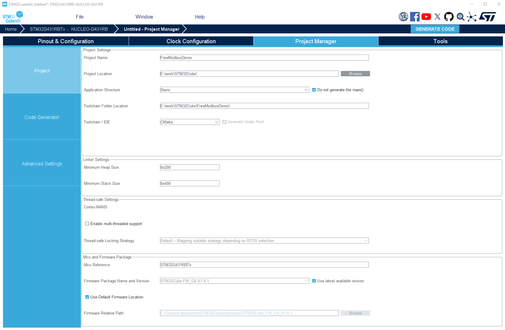

# FreeModbus STM32 Port for CMake Projects

This directory contains a generic port of the FreeModbus library for STM32 microcontrollers. The port is designed to be easily adaptable to different STM32 families while maintaining compatibility with STM32CubeMX-generated projects.

## Development Environment

This project uses **Visual Studio Code** with the [STM32 VS Code Extension](https://marketplace.visualstudio.com/items?itemName=stmicroelectronics.stm32-vscode-extension) as the primary development environment. STM32CubeIDE is not used.

### Required Tools

- **Visual Studio Code**
- **STM32 VS Code Extension**
- **STM32CubeMX** (for project generation)
- **ARM GCC Toolchain**
- **CMake**
- **Ninja** (optional, for faster builds)

## Directory Structure

```
STM32_CMAKE/
├── demo.c                 # Simple demo application showing register usage
├── GenerateCmakeProject.png  # Screenshot of CubeMX project configuration
├── port/                  # Port-specific code
│   ├── portevent.c        # Event handling for Modbus
│   ├── portserial.c       # UART/serial communication
│   ├── porttimer.c        # Timer implementations
│   ├── portcritical.c     # Critical section management
│   ├── port.h             # Main port configuration
│   └── port_internal.h    # Internal port config (processor specific)
```

## Integration with STM32CubeMX Projects

This port is designed to work with projects generated by STM32CubeMX. To properly integrate:

1. Generate a project with STM32CubeMX using the following settings:
   - Application Structure: **Basic**
   - Do not generate the main()
   - Toolchain/IDE: **CMake**

   

2. Add FreeModbus as a Git submodule to your project:
   ```bash
   git submodule add https://github.com/alammertink/freemodbus.git
   ```

3. Modify your project's CMakeLists.txt to include FreeModbus:
   ```cmake
   # After the project() line and add_executable() line

   # Add FreeModbus library
   add_subdirectory(${CMAKE_SOURCE_DIR}/freemodbus ${CMAKE_BINARY_DIR}/freemodbus)

   # Add sources to executable
   target_sources(${CMAKE_PROJECT_NAME} PRIVATE
       # ...existing sources...
       ${CMAKE_SOURCE_DIR}/freemodbus/demo/STM32_CMAKE/demo.c
   )

   # Add FreeModbus include directories
   target_include_directories(${CMAKE_PROJECT_NAME} PRIVATE
       # ...existing include paths...
       ${FREEMODBUS_INCLUDE_DIRS}
   )

   # Link against FreeModbus library
   target_link_libraries(${CMAKE_PROJECT_NAME} PRIVATE
       # ...existing libraries...
       freemodbus
   )
   ```

4. Open the project in VSCode:
   - Install the STM32 VS Code Extension from the [Visual Studio Marketplace](https://marketplace.visualstudio.com/items?itemName=stmicroelectronics.stm32-vscode-extension).
   - Open the project folder in VSCode.

5. Build the project:
   - Press `Ctrl+Shift+P` to open the command palette.
   - Type `STM32: Build` and press Enter.

6. Flash the device:
   - Press `Ctrl+Shift+P` to open the command palette.
   - Type `STM32: Download` and press Enter.

## Custom Integration

If you need to customize the integration with your own application:

1. Don't include the demo.c file directly, but instead create your own application file.
2. Copy the relevant initialization code from demo.c, adapting it to your application.
3. Implement your own register callback functions as needed for your specific application.
4. Make sure to call `eMBPoll()` regularly in your main loop to handle Modbus requests.

## Demo Application

The `demo.c` file provides a simple example of how to initialize and use the FreeModbus library with STM32 microcontrollers. It implements:

- Basic initialization of the Modbus stack
- A callback function for register read/write operations
- A counter updating register values periodically
- Example of how to call the Modbus poll function from your main loop

The demo is meant to be used as a starting point and reference for your own implementation.

## Port Implementation Notes

This port is inspired by both the ADUC7XXX port and the STM32F1 port, with additional improvements:

1. **HAL Compatibility**: Uses STM32 HAL/LL drivers for improved compatibility across STM32 families.
2. **Timer Implementation**: Uses a general-purpose timer for Modbus timing.
3. **Critical Section**: Implements critical sections using `__disable_irq()` and `__enable_irq()`.
4. **UART Configuration**: Supports interrupt-driven UART for efficient operation.

The port has been tested with STM32G4 series but should work with minimal modifications on other STM32 families, including the STM32F3 series.

## Example Usage

```c
#include "mb.h"

// Define the Modbus slave address
#define MB_SLAVE_ADDR     1

// Define the Modbus register holdings
USHORT usRegHoldingBuf[4] = { 0 };

int main(void)
{
    // Initialize HAL and peripherals
    HAL_Init();
    SystemClock_Config();
    MX_GPIO_Init();
    MX_USART2_UART_Init();
    
    // Initialize Modbus protocol stack
    eMBInit(MB_RTU, MB_SLAVE_ADDR, 0, 115200, MB_PAR_NONE);
    
    // Enable the Modbus protocol stack
    eMBEnable();
    
    while(1)
    {
        // Poll the Modbus state machine
        eMBPoll();
        
        // Update your application state here
        usRegHoldingBuf[0]++;
    }
}
```

3. For serial service mode and other advanced features, refer to the ADUC project included in the repository.

## Known Limitations

- UART baud rate changes require reinitialization of the Modbus stack.
- The current implementation only supports RTU mode (ASCII mode is not tested).
- The port uses a hardware timer which may conflict with other timer-using peripherals.

## License

This STM32 CMake port follows the multi-license structure of the original FreeModbus project:

- Port files (`port/*.c`, `port/*.h`): LGPL License
- Demo application (`demo.c`): GPL License

The LGPL license allows integration of the port files into proprietary software under certain conditions, while the GPL license for the demo application requires that any derivative work also be licensed under GPL.

For specific details, see the license headers in individual source files and refer to the full license texts in the root directory of the original FreeModbus repository.

## Additional Information

For more detailed information about the FreeModbus protocol implementation, refer to the official documentation in the root directory of the FreeModbus library.
